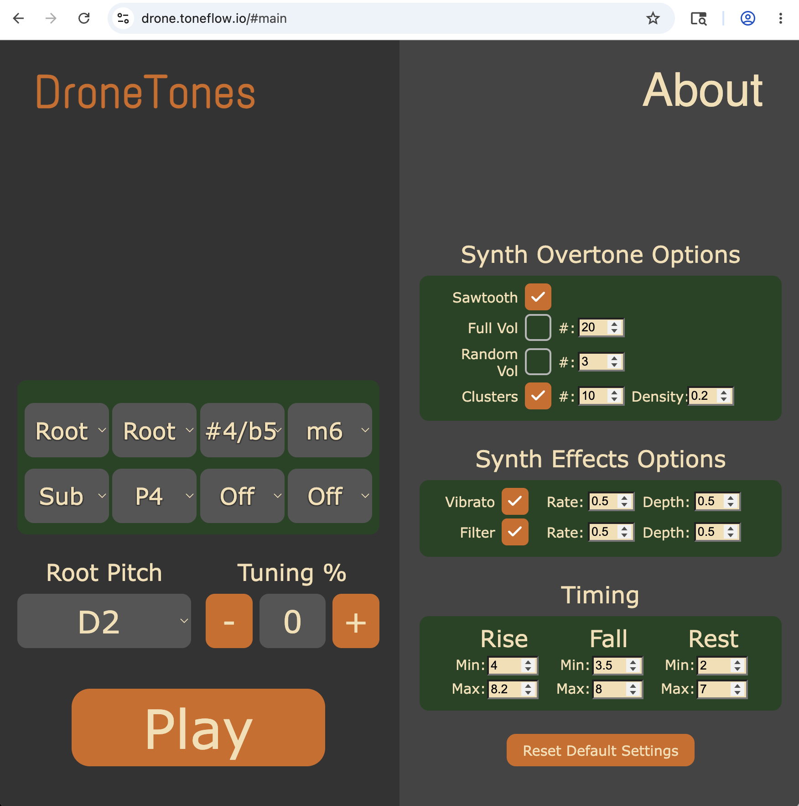

**Source:** <https://drone.toneflow.io/> · Creative Commons 2019.

## Identity

DroneTones is a **generative drone synthesizer**. Press Play and hear a slowly-evolving wash of up to 8 voices that breathe in and out at random intervals, each voice re-rolled (tone color, FX rate/depth, timing) just before it swells. Closer to a *meditation engine* than a playable keyboard: you shape the probability space, the instrument plays itself.

## What you take away

A session with this skill yields three durable artifacts:

1. **The listen.** An agent-narrated tour of the instrument while you shape a drone you actually like.
2. **A `.webm` audio file** of the take, captured straight from Tone.js's master output (`scripts/record.js`). Yours to keep, loop, layer, score against.
3. **A recipe JSON** of every panel setting that produced it (`scripts/scrape-recipe.js`). Reproducible, portable, shareable: send the JSON to a friend and they hear the same drone.

Listen + file + recipe = a complete, sharable drone session in two small artifacts.

## Modes

This skill supports two collaboration modes. Pick before starting.

### manual-learning (human-driven)
Human at the GUI, Claude narrates: what to click, what to listen for, what the controls mean. Output is a take *plus* the human's improved understanding of the instrument. Slow but pedagogical. Use the **First 60 seconds** + **Mental model** sections below.

### agent-driven (Claude-driven)
Claude operates the page headlessly via **`browser-runner`**, the primitive skill this one depends on (see `depends_on:` in the frontmatter). Install it alongside this skill; invoke its binary directly at `<browser-runner>/scripts/bin/browser-runner.js`.

**Use the canonical scripts in `scripts/`. Do not write your own.**

- `scrape-recipe.js` — captures panel state to a JSON recipe.
- `record-async.js` — records audio to `dronetones-<ts>.webm`. **To change duration, edit `DURATION_MS` at the top of the file** (default 60_000 ms). Do not fork.
- `record.js` — fire-and-forget variant for paste-in-devtools only; do not use in recipes.

A canonical recipe lives at `scripts/take.yaml`. To roll a take:

```bash
node <browser-runner>/scripts/bin/browser-runner.js \
  run <dronetones>/scripts/take.yaml \
  --out tmp/dronetones/
```

Recipe `eval:` paths resolve relative to the recipe file, so `take.yaml` references the canonical scripts by bare filename. Outputs land under `--out`. Repeated runs into the same `--out` are numbered: `take-001.webm`, `take-002.webm`, etc.

#### Session-authored recipes

For one-off recipes (custom step order, extra probes), author the YAML anywhere and use **absolute paths** to the canonical scripts so `eval:` resolves correctly regardless of where the YAML lives:

```yaml
url: https://drone.toneflow.io/
headless: true
ready: "typeof Tone !== 'undefined' && !!Tone.Master"
steps:
  - eval: /absolute/path/to/dronetones/scripts/scrape-recipe.js
    save_stdout: recipe-{n}.json
  - click: "#start_stop"
  - sleep: 2s
  - eval: /absolute/path/to/dronetones/scripts/record-async.js
    capture_download: "dronetones-*.webm"
    capture_download_to: take-{n}.webm
  - click: "#start_stop"
```

The canonical `scripts/take.yaml` works because it lives next to the scripts. Your session YAML can live anywhere if it points at the skill's `scripts/` dir absolutely. Do not write a relative path that mirrors your cwd, it will double-apply against the recipe file's directory and miss.

Three sub-variants:

- **2a. solo + proof.** Claude rolls multiple takes autonomously; human listens and picks.
- **2b. brief + execute.** Human and Claude discuss the target sound; Claude dials and captures.
- **2c. dialog tweaks.** Claude has a take going; human says "more shimmer, less low end"; Claude translates to panel deltas and re-rolls. ~70s round-trip per iteration.

All three need the **Programmatic dial** reference (control IDs, below).

## Instrument type

Generative additive-synth drone cloud. 8 voices. Web Audio via **Tone.js 13.4.10**. No MIDI, no keyboard input. Entirely parameter-driven.

## Mental model & controls

**Voice pitches (8 slots, left column of the screenshot).** Each slot picks an interval relative to the root pitch:
`Off / Sub / Root / m2 / M2 / m3 / M3 / P4 / #4-b5 / P5 / m6 / M6 / m7 / M7 / 8va`
`Off` silences the slot; `Sub` is an octave below root; `8va` is an octave above. Eight different intervals = eight simultaneous voices; setting some to `Off` thins the cloud.

**Root pitch:** `C2 … B2` (chromatic). **Tuning %:** ± cents detune from equal temperament; **1 click of `+`/`-` = 1 cent** (calibrated agent-driven run).

**Synth Overtone Options** (re-rolled per voice per swell):
- `Sawtooth`: all overtones, decreasing volume (classical buzzy saw spectrum). **Default-on; the app appears to require at least one overtone mode active at all times. See Known quirks.**
- `Full Vol` (`#: N`): N overtones at maximum volume (organ-like, harsh stacks).
- `Random Vol` (`#: N`): N overtones at random volumes (sparser flavors).
- `Clusters` (`#: N`, `Density: D`): N clusters of overtones at random volumes spread across the series by density. The most "fingerprint-able" timbre.

**Synth Effects Options** (each voice gets a random value within `[0, set value]`):
- `Vibrato`: `Rate`, `Depth`.
- `Filter` (auto-filter): `Rate`, `Depth`.

**Timing** (independent randomized ranges per voice):
- `Rise` `Min`/`Max`: swell-in duration window.
- `Fall` `Min`/`Max`: swell-out duration window.
- `Rest` `Min`/`Max`: silence between this voice's cycles.
- Inverting min > max is allowed; the app re-tracks them. **Timing is the most fragile knob; touch last, in small steps.** Pushing Rest tight produces dropouts and can put the scheduler into an unrecoverable `non-finite` state requiring page refresh.

`Reset Default Settings` returns the panel.

## First 60 seconds (manual-learning)

1. Open `https://drone.toneflow.io/`.
2. Hit **Play**. You should hear a slow drone evolving immediately (defaults are conservative: Sawtooth, mild Rise/Fall/Rest ranges).
3. Change **Root Pitch** to something low (`C2`) to taste the bottom.
4. Toggle `Clusters` on, `#` ≈ 3, `Density` ≈ 0.5. Listen for the spectral motion.
5. Tighten `Rest` `Max` to ~3 only if you're brave. The cloud thickens, but see the timing warning above.
6. Open the JS console (`F12`). The app logs the generated overtone array per voice on each new swell.

## Programmatic dial (agent-driven)

Every control has a stable ID (discovered via `browser-runner inspect`). Setting `<input>` `.value` + dispatching a `change` event updates app state. For checkboxes, call `.click()` to toggle (which fires `change`). For voice slots and root pitch (`<select>`), set `.value` and dispatch `change`.

| Control               | Selector                            | Type          | Notes |
|----------------------|--------------------------------------|---------------|-------|
| Play / Stop          | `#start_stop`                        | button        | Toggle. Stop, then Play can crash audio context; see Known quirks. |
| Reset                | `#reset`                             | button        | Returns panel to defaults. |
| Voice slots 1–8      | `select:nth-of-type(1)` … `(8)`      | select        | Values: `Off`/`Sub`/`Root`/`m2`/`M2`/`m3`/`M3`/`P4`/`#4/b5`/`P5`/`m6`/`M6`/`m7`/`M7`/`8va` |
| Root pitch           | `#base_pitch`                        | select        | `C2` … `B2` (chromatic, 12 values) |
| Tuning −             | `#tuning_minus`                      | button        | 1 click = −1 cent |
| Tuning +             | `#tuning_plus`                       | button        | 1 click = +1 cent |
| Tuning value display | `#tuning_value`                      | div (read)    | textContent is the signed integer |
| Sawtooth on/off      | `#toggleSawtooth`                    | checkbox      | See overtone-mutual-exclusion in Known quirks |
| Full Vol on/off + #  | `#toggleFullStops`, `#fullStopsRange`| checkbox + num| |
| Random Vol on/off + #| `#toggleRandomStops`, `#randomStopsRange` | checkbox + num | |
| Clusters on/off + # + density | `#toggleClusters`, `#clustersRange`, `#clustersDensity` | checkbox + num + num | |
| Vibrato on/off + rate + depth | `#toggleVibrato`, `#vibratoRate`, `#vibratoDepth` | checkbox + num + num | |
| Filter on/off + rate + depth  | `#toggleFilter`, `#filterRate`, `#filterDepth`    | checkbox + num + num | |
| Rise/Fall/Rest Min/Max | `#riseMin`, `#riseMax`, `#fallMin`, `#fallMax`, `#restMin`, `#restMax` | num | Fragile; see Mental model |

`Tone` is on `window` at version `13.4.10`. Audio reachable via **`Tone.Master`** (not `Tone.getDestination()`, which is a 14.x API).

## Scripts in this skill

Four files in `scripts/`. All three JS files are valid expressions usable both as paste-in-devtools and as `browser-runner` evals.

- **`take.yaml`** — canonical `browser-runner` recipe: scrape panel, press Play, record, stop. See the agent-driven section above for invocation.
- **`scrape-recipe.js`** — reads panel state and emits a recipe JSON (voices, root pitch, tuning %, overtones, FX, timing). Logs + copies to clipboard via devtools `copy()`.
- **`record.js`** — captures Tone.js master output for `DURATION_MS` (default 60s) and auto-downloads `dronetones-<ts>.webm`. **Fire-and-forget**; right for paste-in-devtools where the human waits visually. Requires Play to be running.
- **`record-async.js`** — same as `record.js` but wraps the recording in a Promise the IIFE awaits. **Right for recipe runners** that need `capture_download` to wait for the delayed download fire. Change recording length by editing `DURATION_MS` at the top of the file.

### Use in chat

When operating with a Claude in the room:

- **Never inline script source into chat messages.** Three reasons: it's redundant (the file exists), terminal copy-paste mangles JS reliably, and it obscures provenance ("did Claude write this fresh or is it the skill's code?"). Instead, name the file path and either: (a) have the human open the file and copy it themselves, or (b) `pbcopy < scripts/<name>.js` to ship the canonical text via the OS clipboard. Option (b) needs `pbcopy` permission in Claude Code's sandbox; either pre-allow it or ask the human to.
- **Show, don't paste.** Before pbcopying a script, summarize what it does in one sentence so the human consents to running it.

### Default destination

Outputs (recipe JSON + webm takes) default to **the current working directory**, or `./trials/dronetones/` if the calling project has that convention. Don't assume any specific session path; this skill is project-agnostic.

## Known quirks

- **Stop, then Play can put the audio context into a bad state.** Hitting Stop then Play sometimes leaves the page silent; eventually `TypeError: The provided value is non-finite` fires in the console and the scheduler is dead until a page refresh. Recovery: refresh the page; re-apply your recipe.
- **Overtone modes are mutually-required.** The app keeps at least one overtone mode (Sawtooth / Full Vol / Random Vol / Clusters) checked at all times. To switch from Sawtooth (the default) to anything else: **enable the target overtone first, *then* disable Sawtooth.** Toggling Sawtooth off while it's the only one on silently re-checks it.
- **Timing is fragile.** Pushing Rest `Min`/`Max` tight (e.g. 1/3) crashes the scheduler. Default windows (Rise/Fall 4/8, Rest 2/6) are the safe envelope. Prefer thickening the cloud via more active voices, vibrato/filter, or cluster count rather than tighter Rest.
- **`browser-runner save_stdout` + `capture_download` mutual interaction.** When an `eval` step uses both, `save_stdout` may not write. The downloaded file lands correctly; the eval's return value is the casualty. Filed as a follow-up; for now, choose one or the other per step.
- **Concurrent `browser-runner` invocations serialize on macOS system Chrome.** Three parallel `run` calls actually ran sequentially. Likely a single-instance constraint on the user's Chrome profile. Fix: `BROWSER_RUNNER_CHANNEL=off` after `npm run install-browsers` (switches to bundled Playwright Chromium).

## Web-audio primitives

- **Tone.js 13.4.10** (`Tone.min.js` from cdnjs) is the audio engine. Each voice is built around `Tone.Oscillator` / `Tone.PolySynth` with custom partials, fed through `Tone.Vibrato` and `Tone.AutoFilter`, with `Tone.Gain` envelopes for the rise/fall swell.
- Voice generation is timer-driven JS (random durations within the user ranges) rather than note-scheduled, hence the timing-fragility warning.

## Integration notes

App source is **uncompressed** and laid out MVC-style at the root:

```
droneTones/helpers.js
droneTones/Model.js     ← parameter state
droneTones/View.js      ← DOM wiring
droneTones/Audio.js     ← Tone.js voice construction + scheduling
droneTones/Controller.js
droneTones/App.js       ← entry point
```

- Audio capture: `Tone.Master.connect(Tone.context.createMediaStreamDestination())` then `MediaRecorder` then blob download. See `scripts/record.js` / `record-async.js`.
- The console-logged overtone arrays are *the* serialization of timbre; intercepting them gives full reproduction of any drone session.

## Calibration & shareability

- **Fun:** high. One click, ambient cloud. Hard to make it sound bad.
- **Integratability:** very high. Uncompressed JS, Tone.js, MVC. Every control has a stable ID. Tone.js audio capture works in headless Chrome. Full agent-driven automation confirmed.
- **Shareability:** very high. Pure browser, no install, instant-on. Recipe JSON + webm take = a complete, reproducible drone in two small files.

## See also

- Source: <https://drone.toneflow.io/>
- Tone.js: <https://tonejs.github.io/>
- Background reading the app links to: Wikipedia *Interval (music)*, *Vibrato*, *Audio filter*; teropa.info *Harmonics Explorer* and *Additive Synthesis*.
